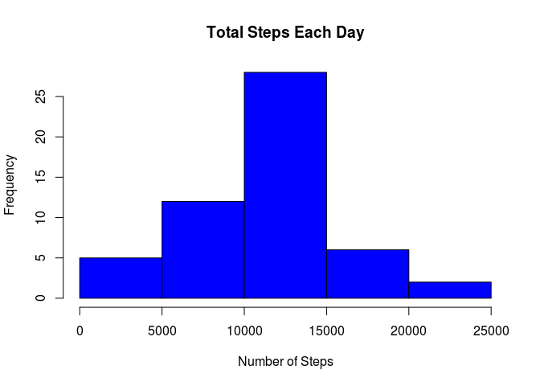
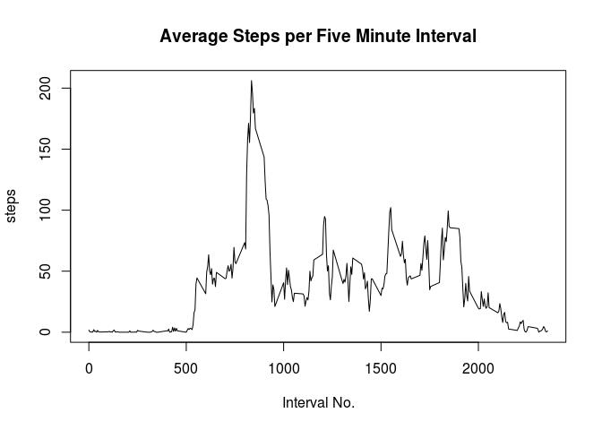
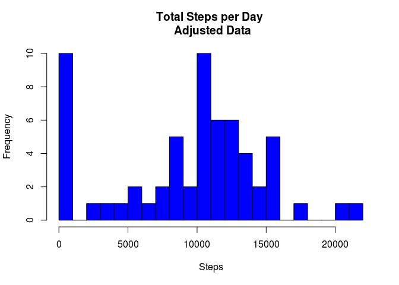
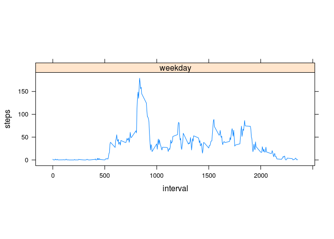

# Reproducible Research: Peer Assessment 1


## Loading and preprocessing the data
* The data file is unzipped.
* The data from the file is loaded into a data frame in memory.


```r
setwd("/home/aditya/DataScienceCoursera/Reproducible\ Research/Course\ Project\ 1/RepData_PeerAssessment1")
unzip("activity.zip")
raw_data <- read.csv("activity.csv")
```

## What is mean total number of steps taken per day?
* Steps per day is totalled.
* A histogram is created for the total number of steps taken each day.
* The mean and median for the total number of steps taken each day is calculated.


```r
raw_steps <- aggregate(steps ~ date, raw_data, sum, na.rm = TRUE)
hist(raw_steps$steps, main = paste("Total Steps Each Day"), col="blue", xlab="Number of Steps")
```



```r
steps_mean <- mean(raw_steps$steps, na.rm = TRUE)
steps_median <- median(raw_steps$steps, na.rm = TRUE)

print(paste("The mean steps per day is: ", steps_mean))
```

```
## [1] "The mean steps per day is:  10766.1886792453"
```

```r
print(paste("The median steps per day is: ", steps_median))
```

```
## [1] "The median steps per day is:  10765"
```

## What is the average daily activity pattern?
* The average daily activy pattern is found by aggregating the data on steps by the interval and taking the mean.
* A graph is then plotted for the pattern.
* The maximum value is found numerically and displayed.


```r
steps_data <- aggregate(steps ~ interval, data=raw_data, mean, na.rm=TRUE)
plot(steps_data$interval, steps_data$steps, type="l", main="Average Steps per Five Minute Interval",
     xlab="Interval No.", ylab="steps")
```



```r
max_steps <- max(steps_data$steps)

print(paste("The maximum number of steps in a five minute interval was: ", max_steps))
```

```
## [1] "The maximum number of steps in a five minute interval was:  206.169811320755"
```

## Imputing missing values
* The number of missing values is found and reported.
* The NA values in the data set has been replaced with the median value.
* The mean and median of new data set are then calculated and displayed.


```r
missing_data <- sum(is.na(raw_data$steps))
print(paste("There are", missing_data, "missing data points."))
```

```
## [1] "There are 2304 missing data points."
```

```r
processed_data <- raw_data
processed_data$steps[is.na(processed_data$steps)] <- median(raw_data$steps, na.rm = TRUE)
processed_day_data <- aggregate(steps ~ date, data=processed_data, sum, na.rm=TRUE)
hist(processed_day_data$steps, breaks=20, main="Total Steps per Day \n Adjusted Data", col="blue", xlab="Steps", ylab="Frequency")
```



```r
processed_steps_mean <- mean(processed_data$steps)
processed_steps_median <- median(processed_data$steps)

print(paste("The mean is: ", processed_steps_mean))
```

```
## [1] "The mean is:  32.4799635701275"
```

```r
print(paste("The median is: ", processed_steps_median))
```

```
## [1] "The median is:  0"
```
The median of the original data was 0. So replacing NA values with zeroes<br />
1. Reduced the mean <br />
2. Had no impact on the median

## Are there differences in activity patterns between weekdays and weekends?

To determing if there are differences in activity patterns between weekdays and weekends, two graphs, one with weekday data and one with weekend data, are plotted.<br />
The graphs are plotted one above the other with the same x-axes, thus enabling to easily note the differences.


```r
processed_data$date <- as.Date(processed_data$date)
processed_data$dayname <- weekdays(processed_data$date)
processed_data$weekend <- as.factor(ifelse(processed_data$dayname == "Saturday" |
                                 processed_data$dayname == "Sunday", "weekend", "weekday"))

plotdata <- aggregate(steps ~ interval + weekend, processed_data, mean)

library(lattice)

xyplot(steps ~ interval | factor(weekend), data=plotdata, aspect=1/3, type="l")
```



